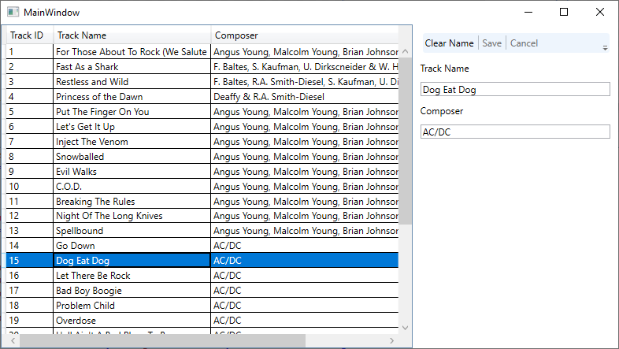
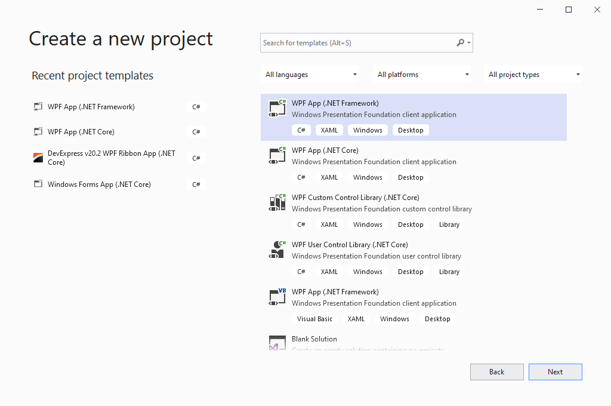
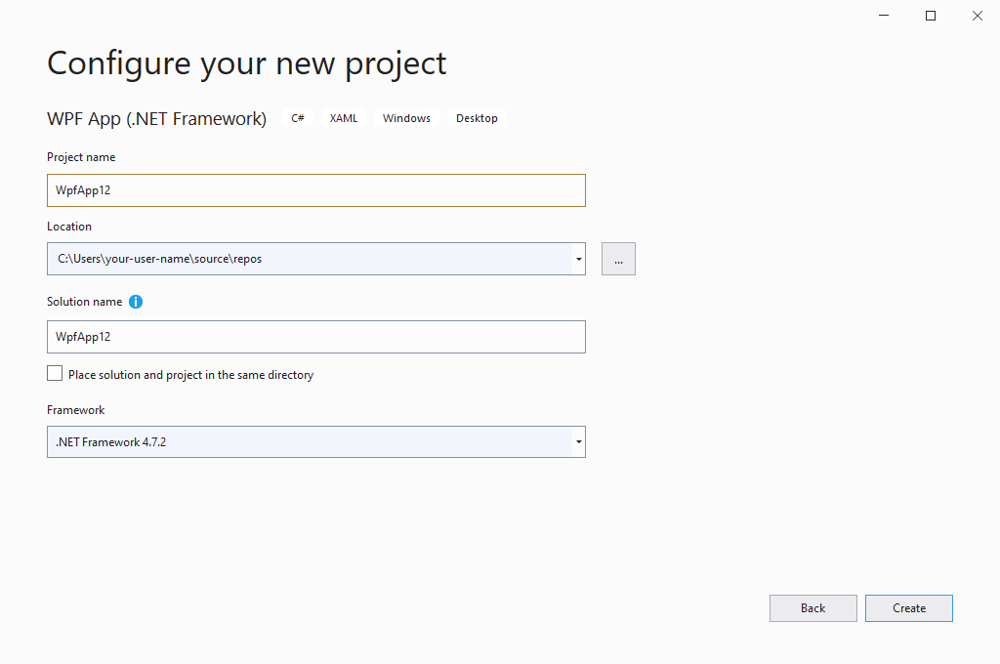
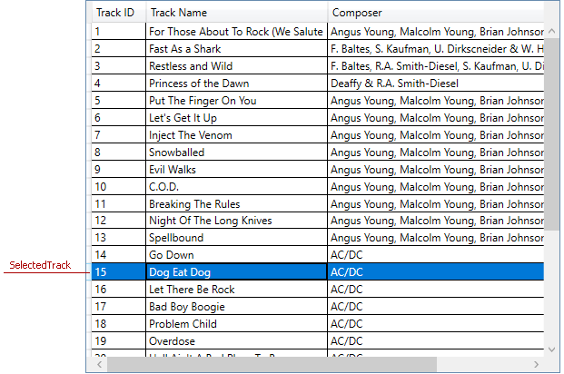
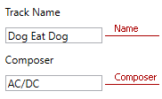

# Tutorial

This tutorial demonstrates how to create a WPF application that implements the MVVM pattern.

The application displays a grid with tracks. You can select a track and change its data in the right panel. The application allows you to save your changes or cancel them. 




## Steps 1-3. Create a WPF Application

1. Run Visual Studio and choose **Create a new project**.
2. Select the **WPF App (.NET Framework)** template and click **Next**.



3. Name your project, choose a disk location, and click **Create**.




## Steps 4-5. Add a Data Model

4. Add the **Data** folder to your project.
5. Add a **TrackInfo** class to the **Data** folder. Paste the following code into the class.

```
public class TrackInfo : INotifyPropertyChanged {
    public TrackInfo() { }
    public TrackInfo(int trackId, string name, int albumId, int mediaTypeId, int genreId, string composer, double milliseconds, double bytes) {
        TrackId = trackId;
        Name = name;
        AlbumId = albumId;
        MediaTypeId = mediaTypeId;
        GenreId = genreId;
        Composer = composer;
        Milliseconds = milliseconds;
        Bytes = bytes;
    }

    int trackId;
    public int TrackId {
        get { return trackId; }
        set {
            if (trackId == value)
                return;
            trackId = value;
            OnPropertyChanged();
        }
    }

    string name;
    public string Name {
        get { return name; }
        set {
            if (name == value)
                return;
            name = value;
            OnPropertyChanged();
        }
    }
    int albumId;
    public int AlbumId {
        get { return albumId; }
        set {
            if (albumId == value)
                return;
            albumId = value;
            OnPropertyChanged();
        }
    }
    int mediaTypeId;
    public int MediaTypeId {
        get { return mediaTypeId; }
        set {
            if (mediaTypeId == value)
                return;
            mediaTypeId = value;
            OnPropertyChanged();
        }
    }
    int genreId;
    public int GenreId {
        get { return genreId; }
        set {
            if (genreId == value)
                return;
            genreId = value;
            OnPropertyChanged();
        }
    }
    string composer;
    public string Composer {
        get { return composer; }
        set {
            if (composer == value)
                return;
            composer = value;
            OnPropertyChanged();
        }
    }
    double milliseconds;
    public double Milliseconds {
        get { return milliseconds; }
        set {
            if (milliseconds == value)
                return;
            milliseconds = value;
            OnPropertyChanged();
        }
    }
    double bytes;
    public double Bytes {
        get { return bytes; }
        set {
            if (bytes == value)
                return;
            bytes = value;
            OnPropertyChanged();
        }
    }

    public override string ToString() {
        return String.Format("Name: {0}, Milliseconds: {1}, Composer: {2}",
          Name, Milliseconds, Composer);
    }

    public event PropertyChangedEventHandler PropertyChanged;

    void OnPropertyChanged([CallerMemberName] string propertyName = null) {
        PropertyChanged?.Invoke(this, new PropertyChangedEventArgs(propertyName));
    }
}
```

6. Add a **TrackList** class to the **Data** folder. Paste the following code into the class.

```
public static class TrackList {
    public static ObservableCollection<TrackInfo> CreateTrackList() {
        var list = new ObservableCollection<TrackInfo>();
        list.Add(new TrackInfo(1, "For Those About To Rock (We Salute You)", 1, 1, 1, "Angus Young, Malcolm Young, Brian Johnson", 343719, 11170334));
        list.Add(new TrackInfo(2, "Fast As a Shark", 3, 2, 1, "F. Baltes, S. Kaufman, U. Dirkscneider & W. Hoffman", 230619, 3990994));
        list.Add(new TrackInfo(3, "Restless and Wild", 3, 2, 1, "F. Baltes, R.A. Smith-Diesel, S. Kaufman, U. Dirkscneider & W. Hoffman", 252051, 4331779));
        list.Add(new TrackInfo(4, "Princess of the Dawn", 3, 2, 1, "Deaffy & R.A. Smith-Diesel", 375418, 6290521));
        list.Add(new TrackInfo(5, "Put The Finger On You", 1, 1, 1, "Angus Young, Malcolm Young, Brian Johnson", 205662, 6713451));
        list.Add(new TrackInfo(6, "Let's Get It Up", 1, 1, 1, "Angus Young, Malcolm Young, Brian Johnson", 233926, 7636561));
        list.Add(new TrackInfo(7, "Inject The Venom", 1, 1, 1, "Angus Young, Malcolm Young, Brian Johnson", 210834, 6852860));
        list.Add(new TrackInfo(8, "Snowballed", 1, 1, 1, "Angus Young, Malcolm Young, Brian Johnson", 203102, 6599424));
        list.Add(new TrackInfo(9, "Evil Walks", 1, 1, 1, "Angus Young, Malcolm Young, Brian Johnson", 263497, 8611245));
        list.Add(new TrackInfo(10, "C.O.D.", 1, 1, 1, "Angus Young, Malcolm Young, Brian Johnson", 199836, 6566314));
        list.Add(new TrackInfo(11, "Breaking The Rules", 1, 1, 1, "Angus Young, Malcolm Young, Brian Johnson", 263288, 8596840));
        list.Add(new TrackInfo(12, "Night Of The Long Knives", 1, 1, 1, "Angus Young, Malcolm Young, Brian Johnson", 205688, 6706347));
        list.Add(new TrackInfo(13, "Spellbound", 1, 1, 1, "Angus Young, Malcolm Young, Brian Johnson", 270863, 8817038));
        list.Add(new TrackInfo(14, "Go Down", 4, 1, 1, "AC/DC", 331180, 10847611));
        list.Add(new TrackInfo(15, "Dog Eat Dog", 4, 1, 1, "AC/DC", 215196, 7032162));
        list.Add(new TrackInfo(16, "Let There Be Rock", 4, 1, 1, "AC/DC", 366654, 12021261));
        list.Add(new TrackInfo(17, "Bad Boy Boogie", 4, 1, 1, "AC/DC", 267728, 8776140));
        list.Add(new TrackInfo(18, "Problem Child", 4, 1, 1, "AC/DC", 325041, 10617116));
        list.Add(new TrackInfo(19, "Overdose", 4, 1, 1, "AC/DC", 369319, 12066294));
        list.Add(new TrackInfo(20, "Hell Ain't A Bad Place To Be", 4, 1, 1, "AC/DC", 254380, 8331286));
        list.Add(new TrackInfo(21, "Whole Lotta Rosie", 4, 1, 1, "AC/DC", 323761, 10547154));
        list.Add(new TrackInfo(22, "Walk On Water", 5, 1, 1, "Steven Tyler, Joe Perry, Jack Blades, Tommy Shaw", 295680, 9719579));
        list.Add(new TrackInfo(23, "Love In An Elevator", 5, 1, 1, "Steven Tyler, Joe Perry", 321828, 10552051));
        list.Add(new TrackInfo(24, "Rag Doll", 5, 1, 1, "Steven Tyler, Joe Perry, Jim Vallance, Holly Knight", 264698, 8675345));
        list.Add(new TrackInfo(25, "What It Takes", 5, 1, 1, "Steven Tyler, Joe Perry, Desmond Child", 310622, 10144730));
        list.Add(new TrackInfo(26, "Dude (Looks Like A Lady)", 5, 1, 1, "Steven Tyler, Joe Perry, Desmond Child", 264855, 8679940));
        list.Add(new TrackInfo(27, "Janie's Got A Gun", 5, 1, 1, "Steven Tyler, Tom Hamilton", 330736, 10869391));
        list.Add(new TrackInfo(28, "Cryin'", 5, 1, 1, "Steven Tyler, Joe Perry, Taylor Rhodes", 309263, 10056995));
        list.Add(new TrackInfo(29, "Amazing", 5, 1, 1, "Steven Tyler, Richie Supa", 356519, 11616195));
        list.Add(new TrackInfo(30, "Blind Man", 5, 1, 1, "Steven Tyler, Joe Perry, Taylor Rhodes", 240718, 7877453));
        return list;
    }
}
```


## Steps 7- ... . Add a View Model

7. Add a **MainViewModel** class to the root folder.
8. Add the **Tracks** property and initialize it with data from the data model. 

```
public ObservableCollection<TrackInfo> Tracks { get; set; }
```

```
public MainViewModel() {
    Tracks = TrackList.CreateTrackList();        
}
```

9. Add the **SelectedTrack** property and initialize it to the first track. You will use this property to get a track selected in the data grid.



```
TrackInfo selectedTrack;
public TrackInfo SelectedTrack {
    get { return selectedTrack; }
    set { 
        selectedTrack = value;
        OnPropertyChanged();
    }
}
```

```
public MainViewModel() {
    Tracks = TrackList.CreateTrackList();
    SelectedTrack = Tracks[0];
}
```

10. Add the **Name** and **Composer** properties. You will use them to change data of a selected track.



```
string name;
public string Name {
    get { return name; }
    set {
        name = value;
        OnPropertyChanged();
    }
}

string composer;
public string Composer {
    get { return composer; }
    set {
        composer = value;
        OnPropertyChanged();
    }
}
```

11. Add the **Load** method. This method allows you to take a track and use the track's data to specify the **Name** and **Composer** properties.

```
void Load(TrackInfo track) {
    if (track != null) {                
        Name = track.Name;
        Composer = track.Composer;
    }
}
```

12. Call the **Load** method in the **SelectedTrack** property's `set` accessor.

```
public TrackInfo SelectedTrack {
    get { return selectedTrack; }
    set {
        selectedTrack = value;
        Load(value);
        OnPropertyChanged();
    }
}
```

13. Add a **RelayCommand** class into the root folder. Paste the following code in the class.

The view uses **RelayCommand** instances as command objects to call methods. The **execute** field is the command's method. The **canExecute** field checks whether to execute the method.

```
public class RelayCommand : ICommand {
    private Action<object> execute;
    private Func<object, bool> canExecute;

    public event EventHandler CanExecuteChanged {
        add { CommandManager.RequerySuggested += value; }
        remove { CommandManager.RequerySuggested -= value; }
    }

    public RelayCommand(Action<object> execute, Func<object, bool> canExecute = null) {
        this.execute = execute;
        this.canExecute = canExecute;
    }

    public bool CanExecute(object parameter) {
        return this.canExecute?.Invoke(parameter) != false;
    }

    public void Execute(object parameter) {
        this.execute(parameter);
    }
}
```

14. // Add the remaining steps.


## Steps ... - ... . Add a View

...